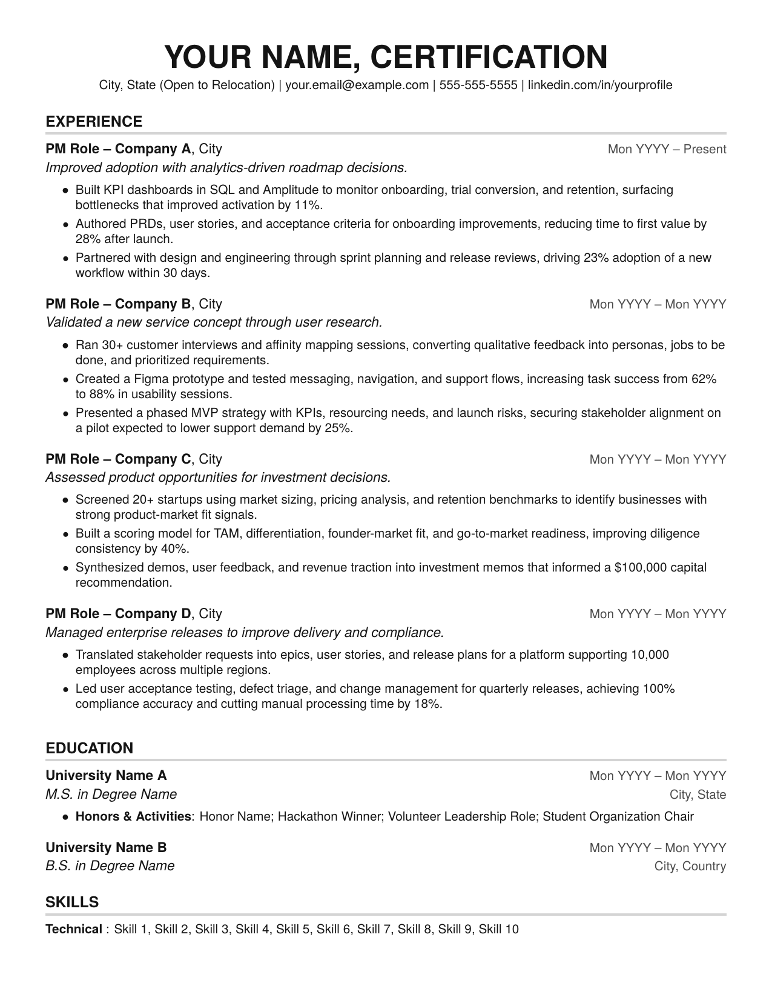

# Wade's Product Resume

A one-page LaTeX resume template for product managers.

This version is inspired by [Harshibar's template](https://www.overleaf.com/latex/templates/harshibars-resume/sbcyynmtpnyd) and [Jake's template](https://www.overleaf.com/latex/templates/jakes-resume/syzfjbzwjncs), then adapted into a public-facing, ATS-conscious product management template.



## What This Repository Includes

- `resume-template.tex`: the editable LaTeX source
- `resume-template.pdf`: a compiled PDF preview
- `.gitignore`: ignores common LaTeX build artifacts

## Why This Template Exists

This template was built from a real product resume iteration, then fully anonymized and rewritten for public use.

The goal is to provide a clean PM-focused structure that:
- stays on one page
- uses quantified impact statements
- follows a simple, ATS-readable layout
- keeps formatting minimal and professional

## ATS Notes

This template was reviewed with feedback from [Quinncia](https://quinncia.io), an ATS-focused resume analysis tool. That feedback informed the public version in a few practical ways:

- clear section headers
- simple one-column layout
- strong action verbs in bullet points
- quantified outcomes where possible
- machine-readable PDF output from LaTeX

That said, ATS tools vary. Passing one checker does not guarantee perfect parsing everywhere, so you should still test your final PDF with the tools available to you.

## Inspiration and Credit

- Harshibar's resume template: [https://www.overleaf.com/latex/templates/harshibars-resume/sbcyynmtpnyd](https://www.overleaf.com/latex/templates/harshibars-resume/sbcyynmtpnyd)
- Jake's resume template: [https://www.overleaf.com/latex/templates/jakes-resume/syzfjbzwjncs](https://www.overleaf.com/latex/templates/jakes-resume/syzfjbzwjncs)

## How To Use

1. Open `resume-template.tex`.
2. Replace all placeholder values such as `YOUR NAME`, `Company A`, `University Name A`, `Mon YYYY`, and `City`.
3. Rewrite the sample bullets to match your own experience.
4. Recompile the PDF.
5. Review the final output for overflow, alignment, and ATS readability.

## Recommended Resume Writing Pattern

A strong bullet usually follows this structure:

`Action verb + skill/tool + business context + quantified result`

Examples:
- Built KPI dashboards in SQL and Amplitude to monitor onboarding performance, improving activation by 11%.
- Created a Figma prototype and tested user flows, increasing task success from 62% to 88%.
- Led user acceptance testing and release coordination, reducing manual processing time by 18%.

## Compile Instructions

### Option 1: Tectonic

```bash
tectonic -X compile resume-template.tex
```

### Option 2: pdfLaTeX

```bash
pdflatex -interaction=nonstopmode -halt-on-error resume-template.tex
```

## Tips For Keeping The Template Clean

- Keep the summary line under each role short.
- Keep company and role names compact, or abbreviate where needed.
- Keep the resume to one page.
- Use consistent punctuation across bullet points.
- Re-check the PDF after every major wording change, especially in the experience section.

## Customization Notes

This template intentionally keeps the structure simple:
- `EXPERIENCE`
- `EDUCATION`
- `SKILLS`

You can add sections like `PROJECTS`, `LANGUAGES`, or `CERTIFICATIONS`, but if you do, review spacing carefully so the document still fits on one page.

## Public Template Scope

This repository is for the anonymized public template only. It does not include any personal resume drafts, source documents, or private job materials.
